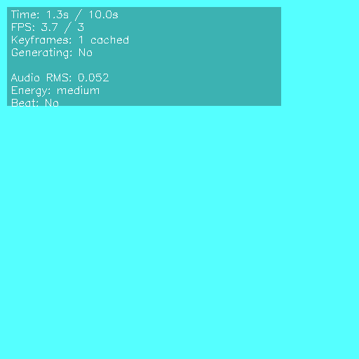

# 🎵 Synthesia - AI Audio-to-Video Generation

Real-time audio analysis and visual generation system that creates reactive visuals from sound input using **Stable Diffusion** and advanced audio processing.



## Project Structure

```
synthesia/
├── src/
│   ├── analyzers/          # Audio analysis components
│   │   ├── enhanced_audio_analyzer.py    # Real-time audio analysis
│   │   └── file_audio_analyzer.py        # File-based audio analysis
│   │
│   ├── generators/         # Visual generation components
│   │   ├── keyframe_manager.py           # Keyframe generation and caching
│   │   ├── frame_interpolator.py         # Audio-reactive interpolation
│   │   └── stable_diffusion_generator.py # SD/FLUX integration
│   │
│   ├── synthesia/         # Main application systems
│   │   ├── audio_visual_sd_system.py     # Real-time SD system
│   │   ├── keyframe_interpolation_system.py # Demo without SD
│   │   └── audio_file_to_video.py        # File to video converter
│   │
│   └── utils/             # Utility modules
│       └── comfyui_integration.py        # ComfyUI custom nodes
│
├── run_realtime.py        # Run real-time audio-visual system
├── run_file_to_video.py   # Convert audio files to videos
└── run_interpolation_demo.py # Run demo without SD

```

## Installation

```bash
# Basic installation (procedural generation only)
pip install -e .

# With Stable Diffusion support
pip install -e ".[sd]"

# Development installation
pip install -e ".[sd,dev]"
```

## Usage

### Real-time Audio-Visual System
```bash
# With Stable Diffusion
python run_realtime.py

# Without SD (procedural only)
python run_realtime.py --no-sd

# Custom settings
python run_realtime.py --fps 60 --width 1920 --height 1080
```

### Audio File to Video
```bash
# Convert MP3/WAV to video
python run_file_to_video.py input.mp3 --save-video --output output.mp4

# With custom SD model
python run_file_to_video.py input.wav --sd-model lightning --save-video
```

### Interpolation Demo
```bash
# Run procedural generation demo
python run_interpolation_demo.py
```

## Module Import Examples

```python
# Import analyzers
from src.analyzers import EnhancedAudioAnalyzer, FileAudioAnalyzer, AudioFeatures

# Import generators
from src.generators import KeyframeManager, FrameInterpolator, create_sd_generator

# Import main systems
from src.synthesia import AudioVisualSDSystem, AudioFileToVideoSystem

# Or import everything from src
from src import (
    EnhancedAudioAnalyzer, FileAudioAnalyzer,
    KeyframeManager, FrameInterpolator,
    AudioVisualSDSystem
)
```

## Features

- **Real-time Audio Analysis**: Analyzes audio input for RMS, frequency bands, beat detection, and tempo estimation
- **Keyframe Generation**: Generates keyframes using either Stable Diffusion or procedural methods
- **Frame Interpolation**: Smooth transitions between keyframes with audio-reactive effects
- **Multiple SD Models**: Support for SDXL-Turbo, SDXL-Lightning, and base models
- **File Processing**: Convert MP3/WAV files to videos with synchronized visuals
- **ComfyUI Integration**: Custom nodes for ComfyUI workflows

## Requirements

- Python 3.8+
- PyAudio (for real-time audio)
- OpenCV (for video processing)
- NumPy, SciPy (for audio analysis)
- Librosa (for file audio processing)
- PyTorch + Diffusers (optional, for Stable Diffusion)

## License

MIT License